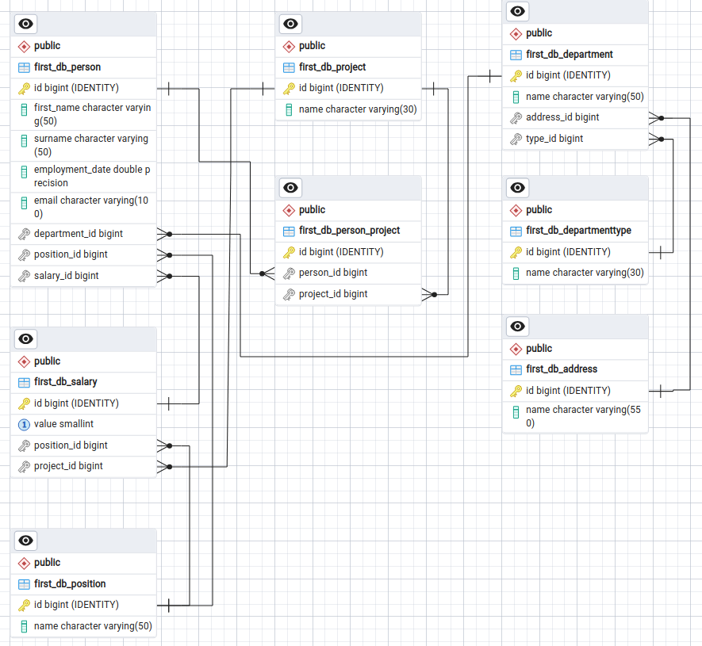

# Домашнее задание к занятию «ELK» - Михалёв Сергей

### Задание 1

Опишите не менее семи таблиц, из которых состоит база данных:

- какие данные хранятся в этих таблицах;
- какой тип данных у столбцов в этих таблицах, если данные хранятся в PostgreSQL.

Приведите решение к следующему виду:

Сотрудники (

- идентификатор, первичный ключ, serial,
- фамилия varchar(50),
- ...
- идентификатор структурного подразделения, внешний ключ, integer).

---
*Решение*
База состоит из таблиц (отношений):
1. Сотрудник:
  - имя *CHAR 50*
  - фамилия *CHAR 50*
  - дата приёма на работу *UnixTimeStamp*
  - ссылка на *ForeignKey* таблицы *'Должность'*
  - ссылка на *ForeignKey* таблицы *'Оклад'*
  - ссылка на *ForeignKey* таблицы *'Структурное подразделение'*
  - отношение *ManyToMany* с таблицей *'Проект'*
3. Должность:
  - название должности *CHAR 50*
4. Структурное подразделение:
  - название подразделения *CHAR 50*
  - ссылка на *ForeignKey* таблицы *'Тип структурного подразделения'*
  - ссылка на *ForeignKey* таблицы *'Адрес филиала'*
5. Тип структурного подразделения:
  - название типа *CHAR 50*
6. Адрес филиала:
  - адрес *CHAR 50*
7. Проект:
  - название проекта *CHAR 50*
8. Оклад:
  - размер оклада NUMERIC или PositiveSmallInteger
  - ссылка на *ForeignKey* таблицы *'Проект'*
  - ссылка на *ForeignKey* таблицы *'Должность'*

Промежуточные таблицы:

9. Сотрудник-проект.

Для большей наглядности воплотил данную стуктуру в [models.py](./models.py) простейшего Django проекта в приложении "first_db".
В итоге в менеджере PgAdmin получилась такая схема отношений:

